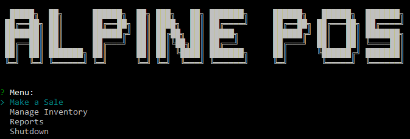
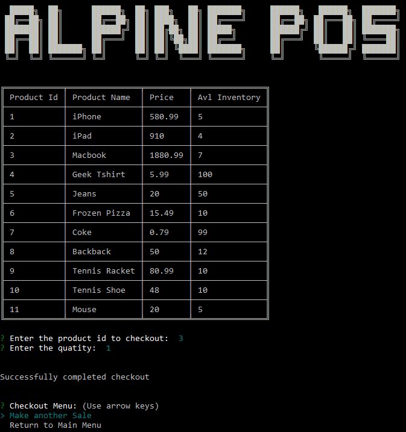
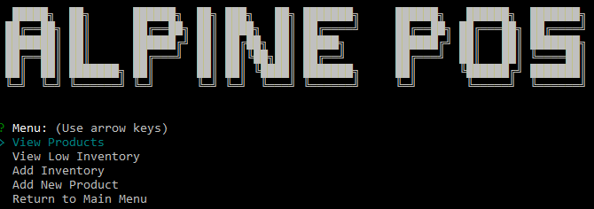
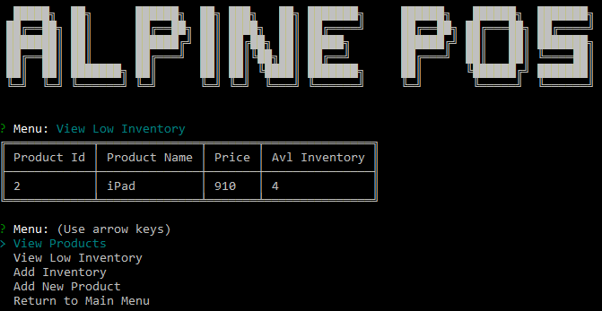
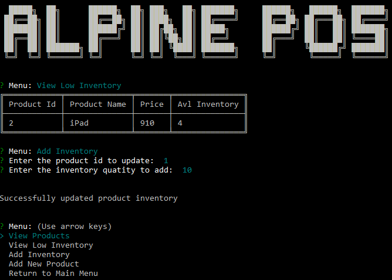
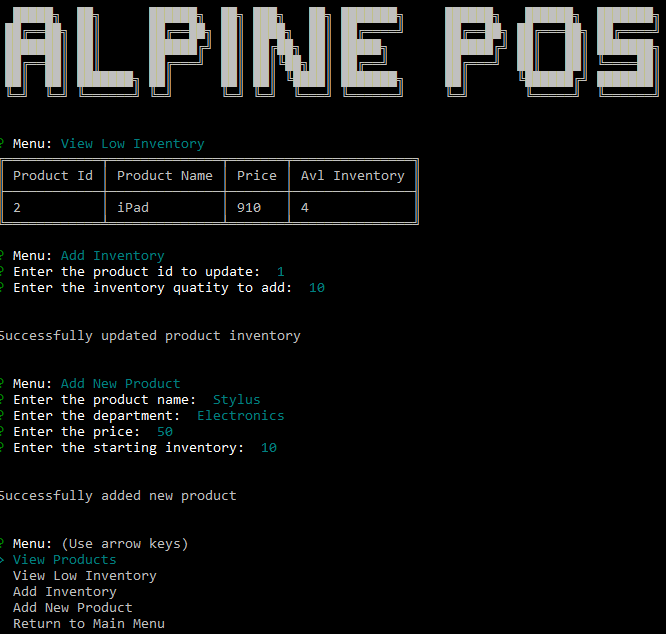
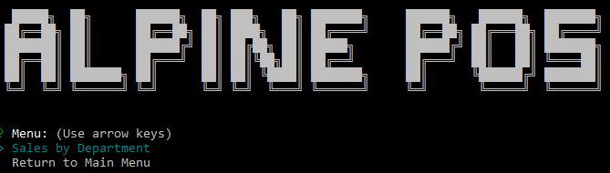
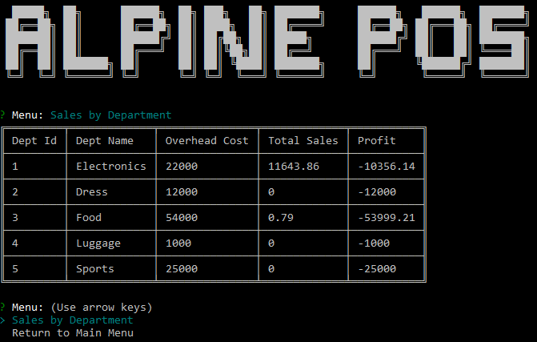

# Alpine Inc Store Point Of Sale

Point of Sale application is used to manage inventory and sale at stores. Information in this page will get you a copy of the project up and running on your local machine for development and testing purposes. 

### Prerequisites

Things you need to install the application and how to install them

```
Node v8 or above
MySQL Database
```

### NPM dependencies

The application has the following NPM package dependencies

```
cfonts v1.1.3
inquirer v5.1.0
log4js v2.5.3
mysql v2.15.0
table v4.0.3
```

### Installing

Clone the repository to your local machine

```
git clone https://github.com/AlpineInc/storepos.git
```

Execute database_ddl.sql against your MySQL database

```
mysql> source database_ddl.sql
```

Modify host, user and password details in database-util.js to match your database settings

```
this.mysqlConfig = {
    host: 'localhost',
    user: 'root',
    password: 'admin',
    database: 'bamazon'
};
```

Install the application dependencies. The dependencies are already configured in the package.json file.

```
npm install
```

Start the POS application in the command line.

```
node bamazon.js
```

## POS application features

### Main menu of the POS application


### Make a sale


### Manage inventory menu


### View items with low inventory


### Replinish inventory


### Add a new product


### Reports menu


### Total sales by Dept report


## Contributing

When contributing to this repository, please first discuss the change you wish to make via issue, email, or any other method with the owners of this repository before making a change.

## Authors

* **Ravish Rao** - *Initial work* - (https://www.linkedin.com/in/ravish-adka-rao-16555610/)

## License

This project is licensed under the MIT License

